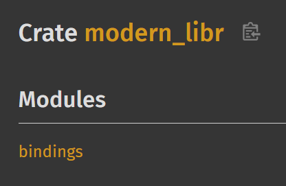

# `modern-libr`

This is a MVP for a bindings strategy that aims to provide a complete
binding of R's C-headers.

With this approach, the R-headers can be made into rust modules.

See the following images of the resulting `cargo doc`

